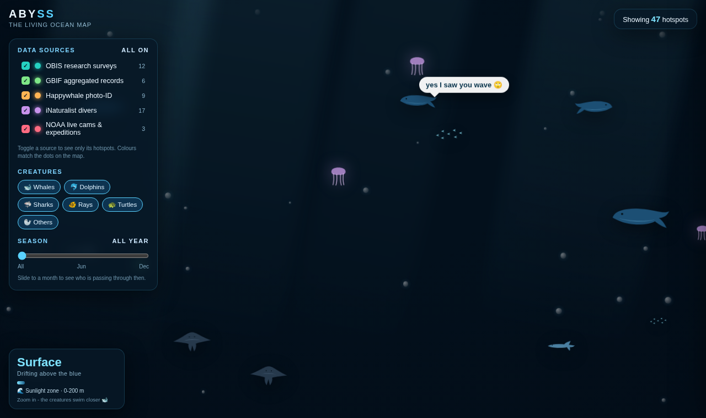

# 🌊 Abyss - The Living Ocean Map

> Google Maps, but for the sea. Find where whales, sharks, mantas and turtles gather around the world, filter by who spotted them, and dive into their stories - all wrapped in a living, animated ocean.



Abyss is a single-file, dependency-light web app that turns open marine-biodiversity data into an immersive map you actually want to explore. Zoom into the sea and illustrated creatures swim right up to you (and yes, they have opinions). Click any hotspot to read where a species is, when it is best seen, and who logged it.

**[▶ Try the live demo](#running-it)** · **[Contribute](CONTRIBUTING.md)** · **[Data sources](docs/DATA_SOURCES.md)**

Created by **[Anushka (Lira) Jain (@lirajain)](https://github.com/lirajain)** · MIT licensed · contributions welcome

---

## ✨ Features

- **A real ocean-floor map.** Built on Esri's world ocean basemap, so zooming genuinely feels like descending through bathymetry.
- **47 real marine hotspots.** Whales, sharks, mantas, turtles, dolphins and more, at real locations with real seasons.
- **Source-coloured layers you can toggle.** Every sighting is colour-coded by where the data comes from - OBIS, GBIF, Happywhale, iNaturalist, NOAA - and you can switch each source on or off.
- **Season slider.** Slide to a month to see who is migrating through then.
- **Creature-type filters.** Show only whales, only sharks, only turtles, and so on.
- **A depth gauge that deepens as you zoom.** Descend from the sunlight zone to the midnight zone while the water darkens around you.
- **A living scene.** Animated whales, dolphins, sharks, mantas, turtles, jellyfish and fish schools swim the whole viewport, scale up as you zoom in, and pop playful thought bubbles.
- **Rich info cards.** Click a hotspot for its story, a fun fact, best season, typical depth, and - for NOAA entries - a real live-cam link.

## 🧭 Why this exists

Most marine sighting maps are built for researchers and look the part. Abyss is an experiment in making that same open data feel wondrous and public - closer to visiting an aquarium than reading a spreadsheet. The long-term vision is a map where clicking a spot shows the newest diver photos and live-cam feeds of the animals actually there.

## 🚀 Running it

Abyss is a single `index.html` file. No build step, no install.

**Option 1 - just open it.** Download `index.html` and open it in any modern browser. You need an internet connection so the ocean-floor map tiles and the map library (Leaflet) can load.

**Option 2 - serve locally.**

```bash
git clone https://github.com/lirajain/abyss-ocean-map.git
cd abyss-ocean-map
python3 -m http.server 8000
# then open http://localhost:8000
```

## 🛠️ How it works

| Layer | What it does |
|-------|--------------|
| **Map** | [Leaflet](https://leafletjs.com/) + Esri World Ocean basemap tiles, recoloured into a deep-sea look with a CSS filter. |
| **Hotspots** | A curated dataset (`D` array in `index.html`) of real species, coordinates, seasons and sources, rendered as glowing markers. |
| **Living creatures** | Hand-built inline SVG sprites animated with `requestAnimationFrame`; density and size scale with map zoom. |
| **Filtering** | Plain JS state (`sources`, `types`, `month`) drives which markers are shown. |

Everything - HTML, CSS and JS - lives in one file on purpose, so it is easy to read, fork and remix.

## 🗺️ Roadmap

- [ ] Wire one source to the live **OBIS API** so a set of hotspots is genuinely real-time
- [ ] Pull real diver photos into the info cards
- [ ] Embed NOAA / explore.org **live whale cams** inside the cards
- [ ] Make creatures react when clicked
- [ ] A "surface right now" layer of recent sightings
- [ ] Mobile polish and offline-friendly tiles

See the [issues](https://github.com/lirajain/abyss-ocean-map/issues) for ways to help. Anything tagged `good first issue` is a friendly place to start.

## 🤝 Contributing

Contributions are very welcome - new species and hotspots, better creature art, real API hookups, accessibility, bug fixes. Read the [Contributing Guide](CONTRIBUTING.md) and the [Code of Conduct](CODE_OF_CONDUCT.md) to get started. Work happens on the `develop` branch; open pull requests against it.

## 📊 Data & attribution

The hotspots are grounded in real species biology and well-documented seasonal aggregations, and the source labels reference real open platforms. In this prototype the records are hand-curated rather than pulled live. See [docs/DATA_SOURCES.md](docs/DATA_SOURCES.md) for the platforms Abyss is designed to draw from and how to credit them.

## 🙌 Author & credits

Abyss was created by **Anushka (Lira) Jain** ([@lirajain](https://github.com/lirajain)).

If you use, fork, build on, or write about Abyss, please credit the author - a link back to this repository and a mention of "Abyss by Anushka (Lira) Jain" is perfect. The MIT license also requires the copyright notice to be kept in any copy or substantial portion of the code. If you would like to cite it formally, use the "Cite this repository" button on the GitHub page (powered by [`CITATION.cff`](CITATION.cff)).

Contributors will be listed here as the project grows - thank you to everyone who adds a species, fixes a bug, or makes a creature swim a little better.

## 📄 License

Released under the [MIT License](LICENSE). The code is free to use, modify and share, as long as the copyright and license notice are preserved. Marine data pulled from external platforms remains subject to each platform's own terms - see the data doc.

---

*Built with curiosity about the ocean by Anushka (Lira) Jain. If Abyss made you want to go diving, it did its job.* 🐋
